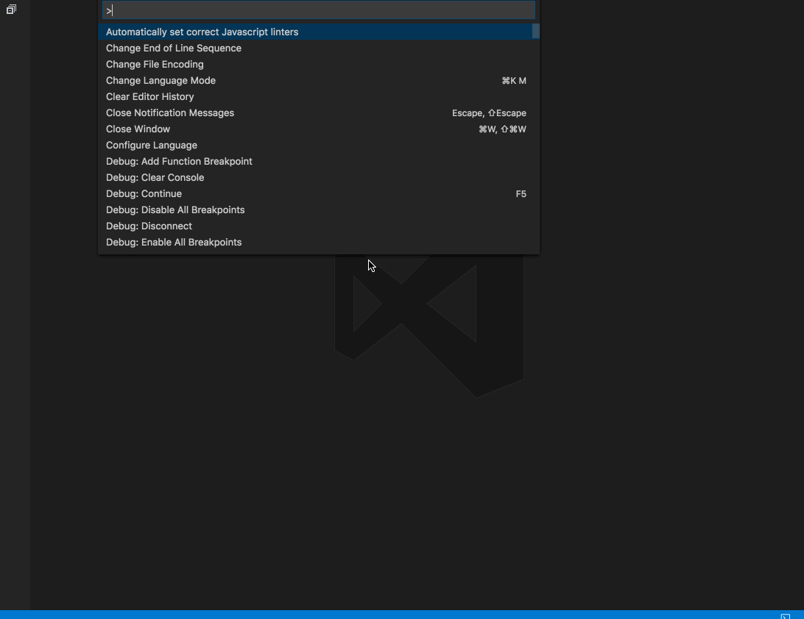

# vscode-babel-repl README

Babel REPL lets you write next generation Javascript and see the transpiled output of Babel.

## Features

With Babel REPL you can write next generation Javascript right in Visual Studio Code and see the transpiled output of Babel right next to it. 
Just open the Command Palette and start the REPL throught the Command "Open new Babel REPL":

## Known Issues

This extension is in a pretty rough state right now and will probably have a lot of bugs.  
If you have any problems please open a issue on Github.

## Release Notes

### 0.1.0

Initial release
